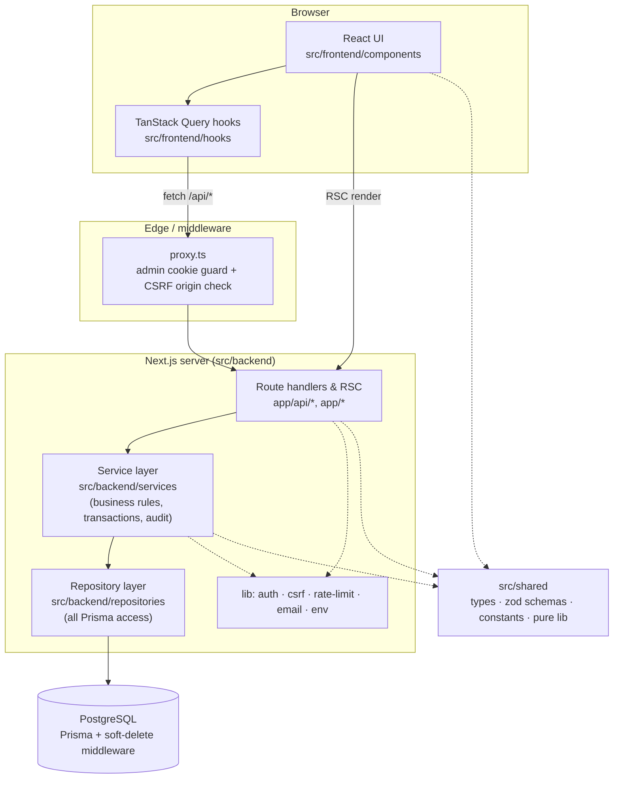
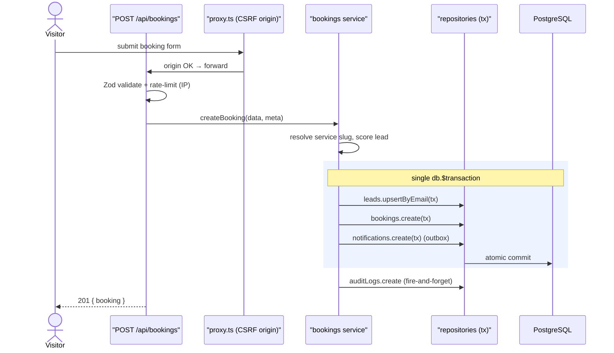
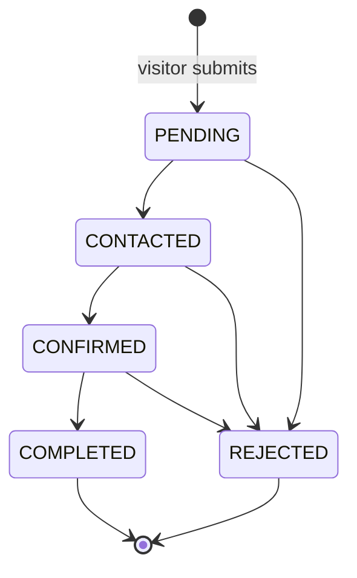
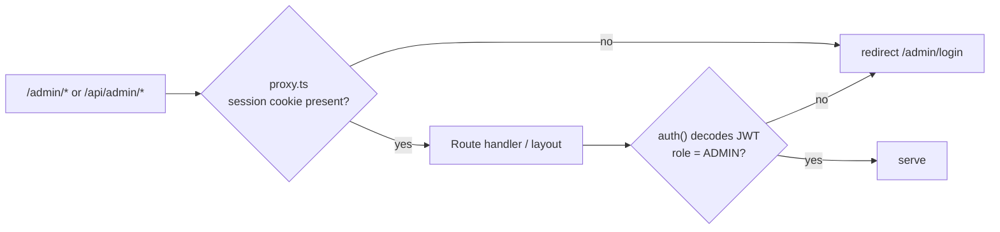

# Architecture — Sunduza Architectural & Projects (v1)

Describes the **implemented** system on `Dev`. Source of truth is the code; this
document is the map. Deep data-layer detail is in
[design/DATA_ACCESS.md](./design/DATA_ACCESS.md); the data model is in
[design/ERD.md](./design/ERD.md).

## Stack

| Layer | Technology |
|-------|-----------|
| Framework | Next.js 16 (App Router, Turbopack), React 19, TypeScript |
| Styling | Tailwind CSS v4 + semantic CSS layer (`app/styles/*`) |
| Data | PostgreSQL (Neon in prod) via Prisma 5 |
| Auth | NextAuth (Auth.js) v5 — Credentials, **JWT sessions** |
| Validation | Zod (shared schemas) |
| State (client) | TanStack Query + Zustand |
| Email / queue | Resend (v2 worker) via a notifications outbox |
| Hosting | Vercel |

## Layered architecture



**The one rule that matters:** only the **repository layer** touches Prisma.
Pages, route handlers and services never import the DB client directly. See
[DATA_ACCESS.md](./design/DATA_ACCESS.md).

## Request lifecycle — a booking submission



## Booking lifecycle (state machine)

Enforced in [`src/shared/lib/booking-transitions.ts`](../src/shared/lib/booking-transitions.ts)
— the admin UI and the write path share this single source of truth.



`COMPLETED` and `REJECTED` are terminal — any other transition is rejected with
a 4xx before it reaches the database.

## Route protection (admin)



- **Layer 1 — `proxy.ts`** (Next.js 16 root export, replaces `middleware.ts`):
  cheap cookie-presence check on `/admin/*`; also enforces a CSRF **origin**
  check on state-changing `/api/*` requests. No DB call.
- **Layer 2 — `auth()`** (`src/backend/lib/auth.ts`): decodes the **JWT** session
  and exposes `id` + `role`. Server layouts and API handlers must call this and
  not rely on the proxy alone.

> **Auth note (v1):** sessions are **JWT**, not database sessions. The
> Credentials provider in Auth.js v5 cannot create DB sessions, so the
> `sessions` / `accounts` / `verification_tokens` tables remain only as
> NextAuth-adapter scaffolding for future OAuth. (Historical specs that say
> "database sessions, never JWT" predate this decision — see PR #60.)

## Directory map

```
app/                     Routes — public pages, /admin/*, /api/*
src/
  frontend/              Browser only — components, hooks, stores, client lib
  backend/
    lib/                 db, auth, csrf, rate-limit, email, env, errors
    services/            Business logic (validation, scoring, transitions, audit)
    repositories/        The ONLY place that imports the Prisma client
  shared/                types · zod schemas · constants · pure lib (no I/O)
prisma/                  schema.prisma, migrations, seed.ts
tests/                   Vitest (unit) + Playwright (e2e)
proxy.ts                 Admin cookie guard + API CSRF origin check
```

## Cross-cutting concerns

| Concern | Where | Notes |
|---------|-------|-------|
| Soft delete | `lib/db.ts` middleware | injects `deletedAt IS NULL` on reads/bulk writes |
| Audit trail | `services/audit.ts` → `repositories/audit-logs` | append-only, fire-and-forget |
| Rate limiting | `lib/rate-limit.ts` | in-memory default, Upstash in prod |
| CSRF | `lib/csrf.ts` + `proxy.ts` | origin check on unsafe methods |
| Auth lockout | `lib/auth.ts` | 10 failures → 15-min lock |
| Notifications | outbox table | rows written in v1, delivered by a v2 worker |

## Health & further reading

- Health: `GET /api/v1/health` (reports DB connectivity).
- Product authority: [design/LOCKED_DESIGN.md](./design/LOCKED_DESIGN.md)
- Requirements: [requirements/FUNCTIONAL_REQUIREMENTS.md](./requirements/FUNCTIONAL_REQUIREMENTS.md) · [requirements/NON_FUNCTIONAL_REQUIREMENTS.md](./requirements/NON_FUNCTIONAL_REQUIREMENTS.md)
- Deploy / go-live: [deployment.md](./deployment.md) · [PRODUCTION_CHECKLIST.md](./PRODUCTION_CHECKLIST.md)
```
