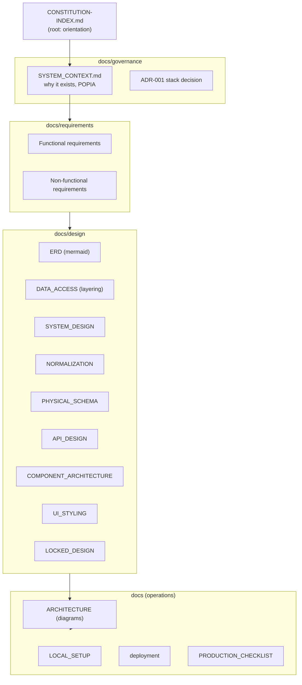

# Documentation — Sunduza Architectural & Projects

The complete map of the project's documentation. Everything authoritative lives
under `docs/`; the only governance pointer at the repo root is
[`../CONSTITUTION-INDEX.md`](../CONSTITUTION-INDEX.md) (session orientation) and
[`../AGENTS.md`](../AGENTS.md) (Next.js 16 build note).

## How the docs fit together

## Start here (operations)

| Document | Purpose |
|----------|---------|
| [ARCHITECTURE.md](./ARCHITECTURE.md) | Stack, layered architecture, request lifecycle, auth model, booking state machine — **with mermaid diagrams** |
| [LOCAL_SETUP.md](./LOCAL_SETUP.md) | `.env.local`, PostgreSQL, migrate, seed, run the dev server |
| [deployment.md](./deployment.md) | Vercel + Neon, cron, production env |
| [PRODUCTION_CHECKLIST.md](./PRODUCTION_CHECKLIST.md) | Pre–go-live checklist before `Dev` → `main` |

## Requirements

| Document | Purpose |
|----------|---------|
| [requirements/FUNCTIONAL_REQUIREMENTS.md](./requirements/FUNCTIONAL_REQUIREMENTS.md) | What the system does, by actor, traced to routes/services (with a use-case diagram) |
| [requirements/NON_FUNCTIONAL_REQUIREMENTS.md](./requirements/NON_FUNCTIONAL_REQUIREMENTS.md) | Security, performance, reliability, privacy, maintainability — how each is met & verified |

## Design & data

| Document | Purpose |
|----------|---------|
| [design/ERD.md](./design/ERD.md) | Entity-relationship diagram (mermaid), cardinality & delete rules, enums, conventions |
| [design/DATA_ACCESS.md](./design/DATA_ACCESS.md) | The layering rule (UI → API → service → repository → DB), transaction pattern, soft delete |
| [design/SYSTEM_DESIGN.md](./design/SYSTEM_DESIGN.md) | Full system design reference |
| [design/NORMALIZATION.md](./design/NORMALIZATION.md) | BCNF analysis and the justified denormalizations |
| [design/PHYSICAL_SCHEMA.md](./design/PHYSICAL_SCHEMA.md) | DDL, indexes, constraints |
| [design/API_DESIGN.md](./design/API_DESIGN.md) | Endpoint contracts and error envelope |
| [design/COMPONENT_ARCHITECTURE.md](./design/COMPONENT_ARCHITECTURE.md) | Frontend component tree and rules |
| [design/UI_STYLING.md](./design/UI_STYLING.md) | Tailwind tokens + semantic CSS layer |
| [design/LOCKED_DESIGN.md](./design/LOCKED_DESIGN.md) | Locked product decisions (historical spec — see its v1 reality note) |
| [design/PROJECT_SUMMARY.md](./design/PROJECT_SUMMARY.md) | Founder-facing project overview |
| [design/ERD_ANALYSIS.md](./design/ERD_ANALYSIS.md) | Deep entity analysis behind the ERD |

## Governance

| Document | Purpose |
|----------|---------|
| [governance/SYSTEM_CONTEXT.md](./governance/SYSTEM_CONTEXT.md) | Problem, workflow, POPIA constraints, launch criteria |
| [governance/ADR-001-nextjs-postgres-stack.md](./governance/ADR-001-nextjs-postgres-stack.md) | The stack decision and alternatives |
| [governance/README.md](./governance/README.md) | Where the engineering standards now live |

## Conventions for these docs

- **Diagrams over prose** where a picture is clearer — ERD, architecture,
  sequence, and state diagrams use **mermaid** so they render on GitHub and stay
  in version control.
- **Single source of truth.** The Prisma schema drives the ERD; the code drives
  the architecture docs. When they disagree, the code wins — fix the doc.
- **v1 reality notes.** Where the shipped system refined an earlier locked
  decision (e.g. JWT vs database sessions), the doc says so explicitly rather
  than pretending history didn't happen.
