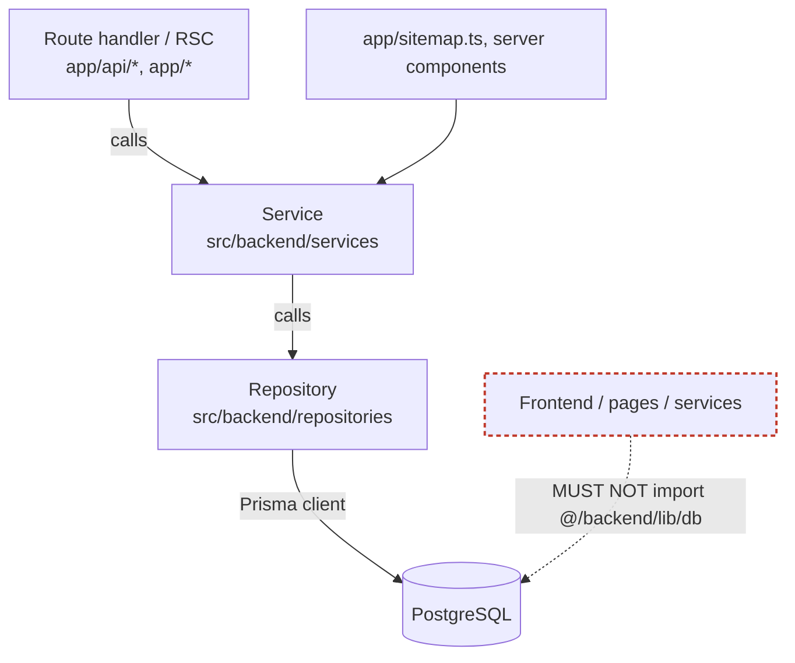
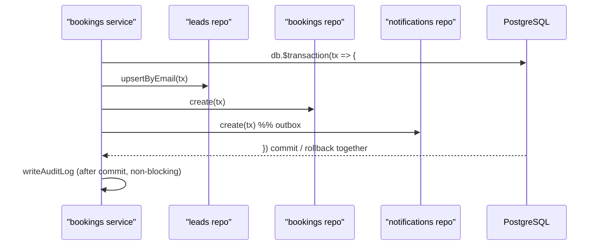

# Data Access & Layering — Sunduza Architectural & Projects

How data flows from an HTTP request to PostgreSQL, and the rule that keeps it
clean: **only the repository layer touches Prisma.**

## The layers



| Layer | Responsibility | May import |
|-------|----------------|-----------|
| **Route handler / RSC** | HTTP concerns: parse, Zod-validate, rate-limit, auth, shape the response | services, shared schemas |
| **Service** (`src/backend/services`) | Business rules: validation beyond shape, lead scoring, booking status transitions, the services cache, **transaction orchestration**, audit logging | repositories, other services, shared lib |
| **Repository** (`src/backend/repositories`) | **All** Prisma queries + `select` projections for one aggregate. No business rules, no audit, no auth | `@/backend/lib/db`, shared types |
| **Prisma client** (`src/backend/lib/db`) | Singleton + soft-delete middleware | — |

Nothing above the repository layer imports `@/backend/lib/db`. This is
enforceable by review/lint and verified during the v1 hardening pass (only
`app/sitemap.ts` violated it; it now calls `getProjectRefs()`).

## Why a repository layer (and why it's thin on purpose)

Prisma is already a data-mapper, so repositories are deliberately thin — they
exist to give the codebase **one boundary** where SQL/ORM concerns live:

- **Single source of query truth.** Every `select` projection for an entity is
  in one file, reused by every caller, so the shape can't drift.
- **Testability.** Services can be reasoned about (and mocked) against a small,
  explicit repository surface instead of the entire Prisma client.
- **Transaction composition.** Each repository function takes an optional
  `DbClient` (the singleton **or** a transaction client), so the same function
  works standalone and inside `db.$transaction`.

## Transaction pattern

A booking write spans three tables and must be atomic. The **service** owns the
transaction boundary; **repositories** run the queries against the `tx` client:



```ts
// service — owns orchestration + business rules
const booking = await db.$transaction(async (tx) => {
  const lead = await upsertLead(tx, { email, name, phone });
  const created = await bookingsRepository.create({ leadId: lead.id, /* … */ }, tx);
  await notificationsRepository.create({ /* outbox */ }, tx);
  return created;
});
await writeAuditLog({ /* … */ }); // fire-and-forget; never breaks the request
```

```ts
// repository — pure persistence, accepts the tx client
create(data: Prisma.BookingUncheckedCreateInput, client: DbClient = db) {
  return client.booking.create({ data, select: bookingConfirmSelect });
}
```

## Soft delete is automatic

The Prisma singleton installs a middleware that injects `deletedAt IS NULL` into
every read, aggregate and bulk write on soft-deletable models — including queries
issued through a transaction client. Repositories therefore never re-implement
the filter; a "delete" is an `update` that stamps `deletedAt`. Audit logs are the
one exception: append-only, never filtered, never deleted.

## Repositories ↔ entities

| Repository | Table | Notable methods |
|------------|-------|-----------------|
| `projects.repository` | `projects` | `findMany(featured?)`, `findRefs` (sitemap), CRUD + `softDelete` |
| `bookings.repository` | `bookings` | `create(tx)`, `findPage`, `findStatusById`, `update`, `softDelete` |
| `leads.repository` | `leads` | `findByEmail`, `touchLastSeen`, `create`, `findPage` |
| `testimonials.repository` | `testimonials` | `findActive`, `findAll`, CRUD + `softDelete` |
| `contact-messages.repository` | `contact_messages` | `create`, `findMany(unreadOnly)`, `markRead` |
| `services.repository` | `services` | `findActive`, CRUD + `softDelete` |
| `site-settings.repository` | `site_settings` | `findMany`, `findValueByKey`, `update` |
| `notifications.repository` | `notifications` | `create(tx)` (outbox) |
| `audit-logs.repository` | `audit_logs` | `create`, `findPage` |

See [ERD.md](./ERD.md) for the data model and [../ARCHITECTURE.md](../ARCHITECTURE.md)
for the request lifecycle.
```
