# Entity-Relationship Diagram — Sunduza Architectural & Projects

> Source of truth: [`prisma/schema.prisma`](../../prisma/schema.prisma). This
> diagram is kept in lock-step with the schema — update both together.
> Deep design rationale (normalization, denormalization trade-offs, index
> strategy) lives in [ERD_ANALYSIS.md](./ERD_ANALYSIS.md) and
> [NORMALIZATION.md](./NORMALIZATION.md).

## Diagram

```mermaid
erDiagram
    USER ||--o{ SESSION         : "has"
    USER ||--o{ ACCOUNT         : "has (OAuth, v2)"
    USER ||--o{ AUDIT_LOG       : "performs"
    USER ||--o{ SITE_SETTINGS   : "last updated by"

    LEAD ||--o{ BOOKING         : "places"
    SERVICE ||--o{ BOOKING      : "selected in"

    PROJECT ||--o{ TESTIMONIAL  : "features"
    PROJECT ||--o{ PROJECT_TAG  : "classified by"
    TAG ||--o{ PROJECT_TAG      : "applied to"

    USER {
        string   id PK
        citext   email UK
        string   password "bcrypt hash"
        UserRole role "ADMIN | EDITOR | VIEWER"
        int      failedAttempts
        datetime lockedUntil
        datetime deletedAt "soft delete"
    }
    SESSION {
        string   id PK
        string   sessionToken UK
        string   userId FK
        datetime expires
    }
    ACCOUNT {
        string id PK
        string userId FK
        string provider
        string providerAccountId
    }
    LEAD {
        string   id PK
        citext   email UK
        string   name "first-contact snapshot"
        string   phone
        int      bookingCount "denormalized counter"
        datetime firstSeenAt
        datetime lastSeenAt
        datetime deletedAt
    }
    SERVICE {
        string   id PK
        string   slug UK
        string   name
        boolean  isActive
        int      sortOrder
        datetime deletedAt
    }
    BOOKING {
        string        id PK
        string        idempotencyKey UK
        string        leadId FK "SET NULL"
        string        serviceId FK "SET NULL"
        string        service "immutable slug snapshot"
        string        email
        bigint        budgetMinCents
        bigint        budgetMaxCents
        BookingStatus status "PENDING..REJECTED"
        int           leadScore "denormalized"
        boolean       consentGiven "POPIA"
        datetime      deletedAt
    }
    PROJECT {
        string   id PK
        string   title
        string   imagePath
        string   category "denormalized primary axis"
        boolean  isFeatured
        int      sortOrder
        datetime deletedAt
    }
    TAG {
        string   id PK
        string   slug UK
        string   name
        datetime deletedAt
    }
    PROJECT_TAG {
        string projectId PK "FK to projects"
        string tagId PK "FK to tags"
    }
    TESTIMONIAL {
        string   id PK
        string   clientName
        string   review
        int      rating "1-5 (CHECK)"
        string   projectId FK "SET NULL, nullable"
        boolean  isActive
        datetime deletedAt
    }
    CONTACT_MESSAGE {
        string   id PK
        string   idempotencyKey UK
        citext   email
        string   message
        boolean  read
        datetime deletedAt
    }
    SITE_SETTINGS {
        string           id PK
        string           key UK
        string           value
        SettingValueType valueType
        boolean          isPublic
        string           updatedBy FK "SET NULL"
    }
    NOTIFICATION {
        string   id PK
        string   type
        string   channel
        string   recipient
        json     payload
        datetime sentAt "null = pending"
    }
    AUDIT_LOG {
        string      id PK
        AuditAction action
        string      entityType "polymorphic"
        string      entityId "polymorphic"
        string      userId FK "SET NULL"
        json        metadata
        datetime    createdAt "append-only"
    }
    VERIFICATION_TOKEN {
        string   identifier
        string   token UK
        datetime expires
    }
```



`CONTACT_MESSAGE`, `NOTIFICATION`, `VERIFICATION_TOKEN` and `ATTACHMENT` are
standalone in v1 (no enforced FK): contact messages are intentionally separate
from the booking funnel; notifications and audit logs use a **polymorphic**
`(entityType, entityId)` reference so they survive deletion of the row they
describe; verification tokens and attachments are NextAuth / future-feature
scaffolding.

## Relationships, cardinality & delete rules

| Parent | Child | Cardinality | On delete | Why |
|--------|-------|-------------|-----------|-----|
| User | Session | 1 → N | `CASCADE` | Sessions are meaningless without their user. |
| User | Account | 1 → N | `CASCADE` | OAuth links die with the user (v2). |
| User | AuditLog | 1 → N | `SET NULL` | The audit trail outlives the actor. |
| User | SiteSettings | 1 → N | `SET NULL` | A setting survives the editor who last changed it. |
| Lead | Booking | 1 → N | `SET NULL` | A booking is an immutable record; it survives a purged lead. |
| Service | Booking | 1 → N | `SET NULL` | Retiring a service must not erase historical bookings — the `service` slug snapshot preserves attribution. |
| Project | Testimonial | 1 → N | `SET NULL` | A review can outlive (or never reference) a project. |
| Project ↔ Tag | ProjectTag | N ↔ M | `CASCADE` both sides | The join row is meaningless if either end is hard-deleted. |

## Enumerations

| Enum | Values | Used by |
|------|--------|---------|
| `UserRole` | `ADMIN`, `EDITOR`, `VIEWER` | `User.role` (EDITOR/VIEWER reserved for future staff onboarding) |
| `BookingStatus` | `PENDING` → `CONTACTED` → `CONFIRMED` → `COMPLETED` \| `REJECTED` | `Booking.status` (transitions enforced in the service layer — see [DATA_ACCESS.md](./DATA_ACCESS.md)) |
| `SettingValueType` | `STRING`, `INTEGER`, `BOOLEAN`, `JSON`, `URL`, `EMAIL`, `PHONE` | `SiteSettings.valueType` (drives the admin input control) |
| `AuditAction` | 14 actions (login, booking, project, testimonial, contact, settings) | `AuditLog.action` |

## Cross-cutting conventions

- **Soft delete.** Every business table carries `deletedAt`. A Prisma
  middleware injects `deletedAt IS NULL` on every read/aggregate/bulk write, so
  the application never sees tombstoned rows unless it explicitly asks. Audit
  logs are the deliberate exception — append-only, never updated or deleted.
- **Citext.** `email` columns use PostgreSQL `citext` for case-insensitive
  uniqueness and lookup.
- **Money in cents.** Budgets are stored as `BigInt` cents (`budget_min_cents` /
  `budget_max_cents`) with a `Char(3)` currency — never floats. The legacy
  free-text `budget` is a historical snapshot only.
- **Idempotency.** `Booking` and `ContactMessage` carry a unique
  `idempotencyKey` so a retried submission returns the original row.
```
