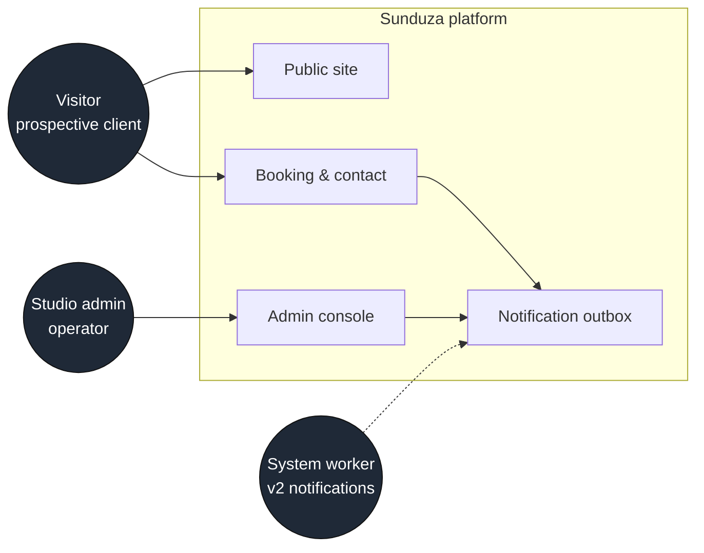

# Functional Requirements — Sunduza Architectural & Projects (v1)

What the system does, by actor. Each requirement is traceable to the routes and
services that implement it. Status reflects **v1 (shipped on `Dev`)**.

## Actors



| Actor | Description |
|-------|-------------|
| **Visitor** | Unauthenticated prospective client browsing the public site and submitting enquiries. |
| **Studio admin** | Authenticated operator (`ADMIN`) managing content and the enquiry pipeline. `EDITOR`/`VIEWER` are reserved for future staff. |
| **System worker** | Background process (v2) that drains the notification outbox. |

## Public site (Visitor)

| ID | Requirement | Implemented by | Status |
|----|-------------|----------------|--------|
| FR-P1 | View the marketing home page with hero, services, featured projects, testimonials. | `app/page.tsx` | ✅ |
| FR-P2 | Browse the full services catalogue. | `app/services`, `GET /api/services` | ✅ |
| FR-P3 | Browse the projects portfolio and open a project detail page. | `app/projects`, `app/projects/[id]`, `GET /api/projects` | ✅ |
| FR-P4 | Read client testimonials. | `app/testimonials`, `GET /api/testimonials` | ✅ |
| FR-P5 | Read the privacy policy (POPIA). | `app/privacy` | ✅ |
| FR-P6 | Reach the studio via a floating WhatsApp action (hidden on admin/contact/booking). | `FloatingWhatsApp` | ✅ |
| FR-P7 | Discover content via SEO: sitemap, robots, JSON-LD structured data. | `app/sitemap.ts`, `app/robots.ts`, `seo/JsonLd` | ✅ |

## Booking & contact (Visitor)

| ID | Requirement | Implemented by | Status |
|----|-------------|----------------|--------|
| FR-B1 | Submit a consultation booking (name, email, phone, service, location, description, optional budget range & meeting date). | `app/booking`, `POST /api/bookings`, `bookings` service | ✅ |
| FR-B2 | Validate the selected service against the live catalogue; reject retired/unknown slugs with a 400. | `bookings` + `services` service | ✅ |
| FR-B3 | Capture marketing attribution (5 UTM dimensions, referrer, landing page) when present. | `bookings` service | ✅ |
| FR-B4 | Record explicit POPIA consent with a timestamp on every booking. | `Booking.consentGiven/At` | ✅ |
| FR-B5 | De-duplicate repeat submitters into a single **Lead** keyed by email, atomically with the booking. | `leads` service (transaction) | ✅ |
| FR-B6 | Compute and store a **lead score** at submission time. | `lead-score` service | ✅ |
| FR-B7 | Submit a general contact message (separate from bookings). | `app/contact`, `POST /api/contact`, `contact` service | ✅ |
| FR-B8 | Throttle abusive submissions per IP. | `lib/rate-limit` | ✅ |
| FR-B9 | Tolerate retried submissions without creating duplicates (idempotency key). | `Booking`/`ContactMessage.idempotencyKey` | ✅ |

## Authentication (Admin)

| ID | Requirement | Implemented by | Status |
|----|-------------|----------------|--------|
| FR-A1 | Sign in with email + password (bcrypt). | `app/admin/login`, `lib/auth` | ✅ |
| FR-A2 | Lock an account for 15 minutes after 10 consecutive failures. | `lib/auth` | ✅ |
| FR-A3 | Rate-limit auth attempts per IP. | `lib/rate-limit` | ✅ |
| FR-A4 | Guard every `/admin/*` route (cookie guard + `auth()` role check). | `proxy.ts`, dashboard layout | ✅ |
| FR-A5 | Sign out and invalidate the session. | NextAuth handlers | ✅ |

## Admin console (Admin)

| ID | Requirement | Implemented by | Status |
|----|-------------|----------------|--------|
| FR-D1 | Dashboard overview of pipeline state. | `app/admin/(dashboard)` | ✅ |
| FR-D2 | **Projects** — create, edit, soft-delete, reorder, feature. | `app/admin/projects`, `/api/projects*` | ✅ |
| FR-D3 | **Testimonials** — create, edit, show/hide, soft-delete. | `app/admin/testimonials`, `/api/testimonials*` | ✅ |
| FR-D4 | **Bookings** — list (paginated, filter by status), view, change status (validated transitions), add notes, soft-delete. | `app/admin/bookings`, `/api/admin/bookings` | ✅ |
| FR-D5 | **Messages** — inbox with read/unread state. | `app/admin/messages`, `/api/admin/messages` | ✅ |
| FR-D6 | **Leads** — list and drill into a lead's full booking history. | `app/admin/leads`, `/api/admin/leads*` | ✅ |
| FR-D7 | **Settings** — edit runtime site settings without redeploying. | `app/admin/settings`, `/api/admin/settings` | ✅ |
| FR-D8 | Enforce booking status transitions (`PENDING→CONTACTED→CONFIRMED→COMPLETED\|REJECTED`); reject invalid moves. | `booking-transitions` | ✅ |

## Cross-cutting / system

| ID | Requirement | Implemented by | Status |
|----|-------------|----------------|--------|
| FR-S1 | Record an immutable audit-log entry for every admin and security-relevant action. | `audit` service (append-only) | ✅ |
| FR-S2 | Write a notification-outbox row on each booking/message, atomically with the entity. | `notifications` repo | ✅ (rows written) |
| FR-S3 | Deliver outbox notifications via email. | v2 worker + Resend | ⏳ v2 |
| FR-S4 | Soft-delete all business entities (recoverable; hidden from reads). | `lib/db` middleware | ✅ |
| FR-S5 | Expose a health endpoint reporting DB connectivity. | `GET /api/v1/health` | ✅ |

Legend: ✅ shipped in v1 · ⏳ planned for v2.

See also: [ERD.md](../design/ERD.md), [API_DESIGN.md](../design/API_DESIGN.md),
[NON_FUNCTIONAL_REQUIREMENTS.md](./NON_FUNCTIONAL_REQUIREMENTS.md).
```
