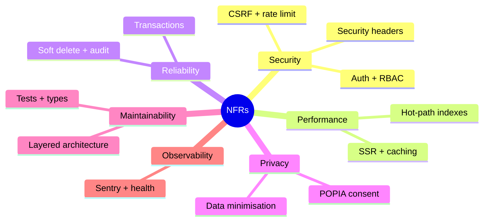

# Non-Functional Requirements — Sunduza Architectural & Projects (v1)

Quality attributes and the mechanisms that satisfy them. Each NFR names how it is
**met** and how it is **verified**.



## Security (NFR-SEC)

| ID | Requirement | Met by | Verified by |
|----|-------------|--------|-------------|
| NFR-SEC1 | Passwords stored only as bcrypt hashes (cost from `BCRYPT_ROUNDS`). | `lib/auth`, seed | code review |
| NFR-SEC2 | Brute-force resistance: per-IP auth rate limit + account lockout after 10 fails. | `lib/rate-limit`, `lib/auth` | `csrf`/auth tests, manual |
| NFR-SEC3 | All state-changing `/api/*` requests pass a same-origin CSRF check. | `proxy.ts`, `lib/csrf` | `csrf.test.ts` (22 cases) |
| NFR-SEC4 | Admin area inaccessible without a valid `ADMIN` session. | `proxy.ts` + `auth()` | manual / e2e |
| NFR-SEC5 | Hardened response headers in production (HSTS, CSP, `X-Frame-Options: DENY`, `nosniff`, Referrer/Permissions policy). | `next.config.ts` | header inspection |
| NFR-SEC6 | Secrets never committed; loaded from env; `.env*` gitignored. | `.gitignore`, `lib/env` | repo scan |
| NFR-SEC7 | No SQL injection surface — parameterised via Prisma; inputs Zod-validated. | repositories, shared schemas | types + tests |

## Performance (NFR-PERF)

| ID | Requirement | Met by |
|----|-------------|--------|
| NFR-PERF1 | Public pages server-render with static/ISR where possible for fast first paint and SEO. | Next.js App Router |
| NFR-PERF2 | Hot admin/list queries backed by partial indexes (`WHERE deleted_at IS NULL`). | raw SQL migrations |
| NFR-PERF3 | Services catalogue (read on every booking) cached in-process with a 60 s TTL, invalidated on write. | `services` service |
| NFR-PERF4 | Pagination on all admin list endpoints (no unbounded scans). | `*.repository.findPage` |
| NFR-PERF5 | Images optimised and lazy-loaded. | `next/image` |

## Reliability & data integrity (NFR-REL)

| ID | Requirement | Met by |
|----|-------------|--------|
| NFR-REL1 | Multi-row writes (lead + booking + outbox) are atomic. | `db.$transaction` in services |
| NFR-REL2 | Deletes are recoverable (soft delete); nothing is physically destroyed by app code. | `lib/db` middleware |
| NFR-REL3 | Every privileged action is captured in an append-only audit log. | `audit` service |
| NFR-REL4 | Audit failure never breaks the user operation (fire-and-forget). | `writeAuditLog` try/catch |
| NFR-REL5 | Money handled as integer cents, never floats. | `Booking.budget*Cents` (BigInt) |
| NFR-REL6 | Retried submissions don't duplicate (idempotency keys). | unique `idempotencyKey` |

## Privacy & compliance (NFR-PRIV) — POPIA

| ID | Requirement | Met by |
|----|-------------|--------|
| NFR-PRIV1 | Explicit, timestamped consent recorded before processing a booking. | `consentGiven/At` |
| NFR-PRIV2 | Data minimisation — only fields needed for the enquiry are collected. | schema design |
| NFR-PRIV3 | A published privacy policy describes processing and rights. | `app/privacy` |
| NFR-PRIV4 | Personal data is recoverable and erasable (soft delete + purge path). | soft delete + `SET NULL` FKs |

## Maintainability (NFR-MAINT)

| ID | Requirement | Met by |
|----|-------------|--------|
| NFR-MAINT1 | Strict separation: UI → API → service → repository → DB; Prisma in one layer only. | [DATA_ACCESS.md](../design/DATA_ACCESS.md) |
| NFR-MAINT2 | End-to-end type safety (TypeScript strict, Zod at the boundaries). | `tsc --noEmit` in CI |
| NFR-MAINT3 | Automated tests for business rules and primitives. | Vitest (54) + Playwright |
| NFR-MAINT4 | Single sources of truth for shared values (contact details, transitions, selects). | `src/shared/*` |
| NFR-MAINT5 | Lint-clean, no dead/stray artifacts in the tree. | ESLint, repo hygiene |

## Usability & accessibility (NFR-UX)

| ID | Requirement | Met by |
|----|-------------|--------|
| NFR-UX1 | Responsive across mobile → desktop. | Tailwind + semantic CSS |
| NFR-UX2 | Keyboard-operable interactive controls with visible focus and ARIA labels. | UI primitives |
| NFR-UX3 | Non-touch desktop users can operate horizontal scrollers via arrows. | `useScrollArrows` |
| NFR-UX4 | Forms give clear inline validation and error feedback. | React Hook Form + Zod |

## Observability & operability (NFR-OPS)

| ID | Requirement | Met by |
|----|-------------|--------|
| NFR-OPS1 | Error monitoring in production. | Sentry (`instrumentation*`) |
| NFR-OPS2 | Health endpoint for uptime checks. | `GET /api/v1/health` |
| NFR-OPS3 | Runtime config editable without redeploy. | `site_settings` + admin UI |
| NFR-OPS4 | Reproducible local setup and seed. | [LOCAL_SETUP.md](../LOCAL_SETUP.md) |

## Portability (NFR-PORT)

| ID | Requirement | Met by |
|----|-------------|--------|
| NFR-PORT1 | Runs on any standard PostgreSQL (local or Neon) via a single `DATABASE_URL`. | Prisma + `DIRECT_URL` |
| NFR-PORT2 | Deployable to Vercel from `main` with no machine-specific config. | `vercel.json`, `next.config.ts` |

See [FUNCTIONAL_REQUIREMENTS.md](./FUNCTIONAL_REQUIREMENTS.md) and
[../PRODUCTION_CHECKLIST.md](../PRODUCTION_CHECKLIST.md).
```
